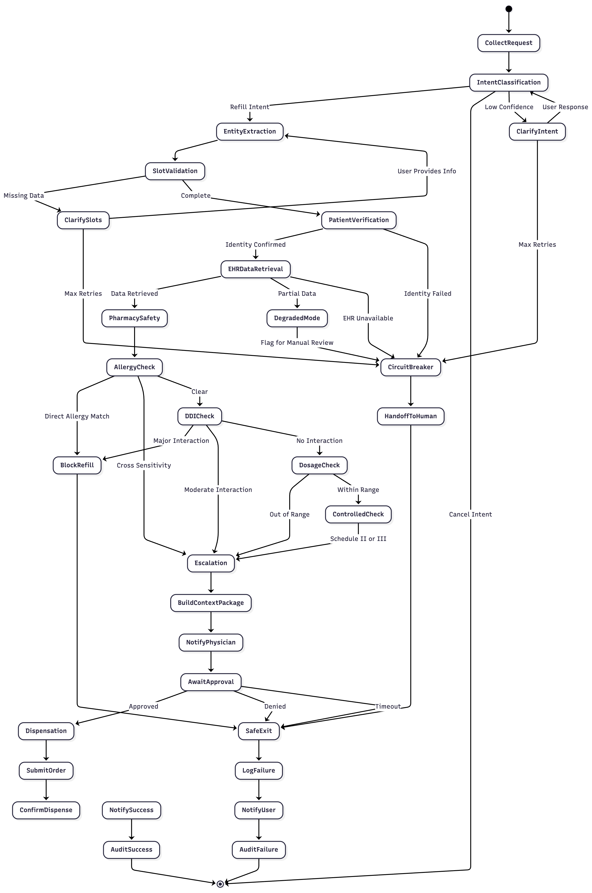
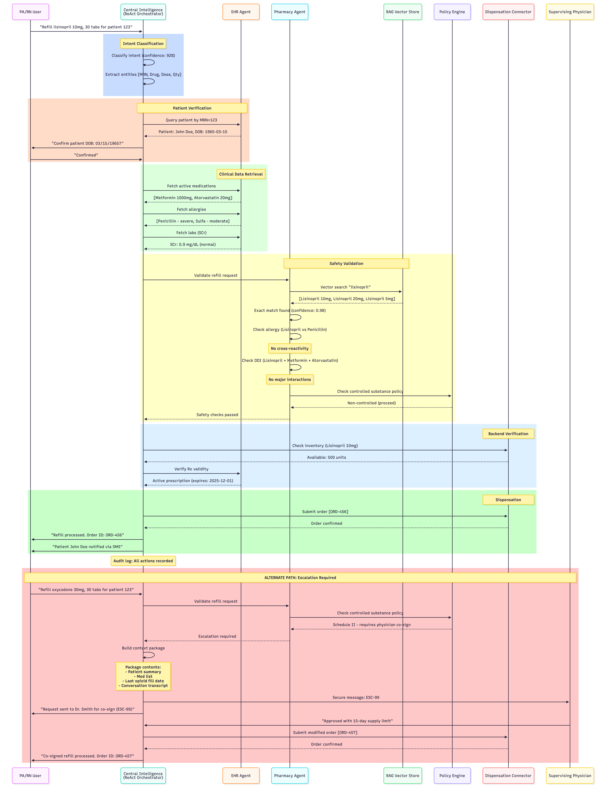

# Perioperative Medication Refill Agent System

## Summary
Multi-agent architecture for automated medication refill processing with 
intelligent escalation, built on LangGraph state machines to ensure safety-first 
design principles.  

## Architecture Key Concepts
- **Healthcare-Compliant**: HIPAA audit trails, controlled substance policies
- **State Machine Design**: LangGraph-based workflow orchestration
- **Safety-First**: Circuit breakers, policy engines, human-in-the-loop
- **MCP Integration**: Tool calling via Model Context Protocol
- **Observability**: OpenTelemetry tracing, structured logging to evaluate performance
- **Scalable Architecture**: Stateless microservices with horizontal scaling and service mesh integration

## Architecture Overview

### Workflow State Machine

The system implements a LangGraph-based state machine with multiple circuit breaker 
points for safe failure handling. Key decision nodes include intent classification,
safety validation, and escalation orchestration.  Note this diagram is not inclusive of all adverse event tracking

### Agent Interaction Sequence

Multi-agent communication flows (coming soon):
- **Happy Path**: Routine refill with all safety checks passing
- **Escalation Path**: Controlled substance requiring physician co-signature

## 🔬 Technology Stack

- **LLM Orchestration**: LangGraph, LangChain
- **LLM Provider**: Anthropic Claude Sonnet 4
- **Vector Store**: FAISS / ChromaDB
- **State Management**: Redis
- **Observability**: OpenTelemetry, Prometheus, LangFuse
- **Policy Engine**: OPA (Open Policy Agent)
- **Testing**: Pytest, Hypothesis (property-based)

## Architecture Deep-Dive
See [ARCHITECTURE.md](./docs/ARCHITECTURE.md)